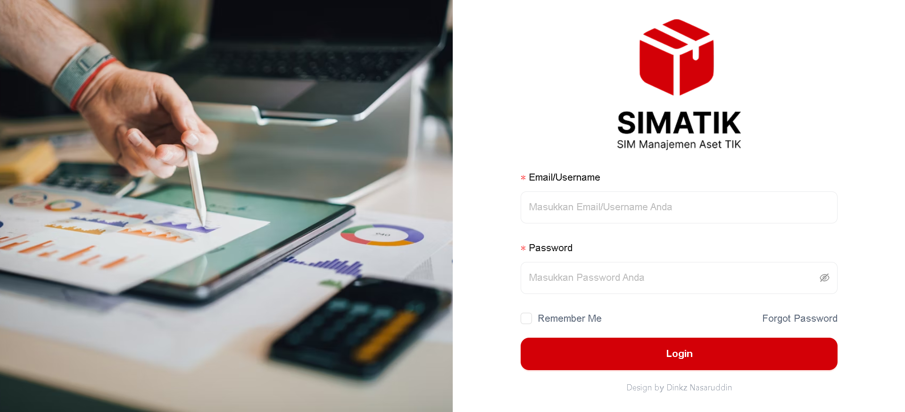
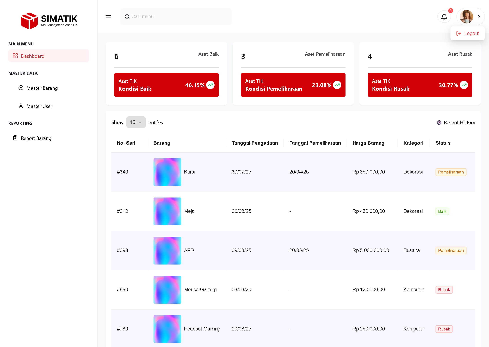

# **SIMATIK - Sistem Informasi Manajemen Aset TIK** 📦

> **Full-Stack Practice Project** </> 🤖 – Backend menggunakan **Laravel 12** & Frontend menggunakan **Vue 3**, dengan desain UI diambil dari [Figma Community](https://www.figma.com/community/file/1426385374644644649/sistem-informasi-manajemen-aset-tik) 🤝

---

## **1. Gambaran Produk** 🌐

**SIMATIK** adalah Sistem Informasi Manajemen Aset TIK berbasis web yang memudahkan proses pencatatan, pelacakan, dan pengelolaan aset teknologi informasi di suatu organisasi.

Beberapa fitur utama:
* **Login & Autentikasi**
* **Dashboard Ringkasan Aset**
* **Master Product**
* **Master User**
* **Export & Extract Data**

---

## **2. Prasyarat Sistem** ⚙️

* **PHP**: ^8.2
* **Composer**: ^2.x
* **Node.js**: ^18.x
* **NPM**: ^9.x
* **MySQL**: ^8.x
* **Git**: ^2.x

---

## **3. Instalasi Backend (Laravel 12)**

1. **Clone repository backend**

   ```bash
   git clone https://github.com/username/simatik-backend.git
   cd simatik-backend
   ```

2. **Install dependencies**

   ```bash
   composer install
   ```

3. **Buat file environment**

   ```bash
   cp .env.example .env
   ```

4. **Konfigurasi database di `.env`**

   ```env
   DB_CONNECTION=mysql
   DB_HOST=127.0.0.1
   DB_PORT=3306
   DB_DATABASE=simatik
   DB_USERNAME=root
   DB_PASSWORD=
   ```

5. **Generate application key**

   ```bash
   php artisan key:generate
   ```

6. **Migrasi & seed database**

   ```bash
   php artisan migrate --seed
   ```

7. **Jalankan server backend**

   ```bash
   php artisan serve
   ```

   Backend berjalan di: **[http://127.0.0.1:8000](http://127.0.0.1:8000)**

---

## **4. Instalasi Frontend (Vue.js 3 + Vite)**

1. **Clone repository frontend**

   ```bash
   git clone https://github.com/username/simatik-frontend.git
   cd simatik-frontend
   ```

2. **Install dependencies**

   ```bash
   npm install
   ```

   atau

   ```bash
   yarn install
   ```

3. **Buat file `.env`**

   ```env
   VITE_API_BASE_URL=http://127.0.0.1:8000/api
   ```

4. **Jalankan development server**

   ```bash
   npm run dev
   ```

   Frontend berjalan di: **[http://127.0.0.1:5173](http://127.0.0.1:5173)**

---

## **5. Tampilan Menu 🖼**

### **5.1 Login**



### **5.2 Forgot Password**


### **5.3 Dashboard**



### **5.4 Master Barang**


### **5.5 Master User**


### **5.6 Report Barang**


---

## **6. Teknologi yang Digunakan** 🛠

**Backend**

* Laravel 12
* Sanctum (API Authentication)
* Barryvdh Laravel DomPDF (Export PDF)

**Frontend**

* Vue.js 3
* Vue Router 4
* Pinia (State Management)
* Ant Design Vue (UI Framework)
* Axios (HTTP Client)
* Day.js (Date Handling)
* Lucide Vue Next (Icons)

**Database**

* MySQL (relational database)

---

## **7. Struktur Folder**

```
simatik/
├── backend/ (Laravel)
│   ├── app/
│   ├── config/
│   ├── database/
│   ├── routes/
│   └── .env
│
└── frontend/ (Vue.js)
    ├── src/
    ├── public/
    ├── vite.config.js
    └── .env
```

---

## **8. Lisensi**

Proyek ini dibuat untuk keperluan pembelajaran.
UI diambil dari [Figma Community](https://www.figma.com/community/file/1426385374644644649/sistem-informasi-manajemen-aset-tik).

---
